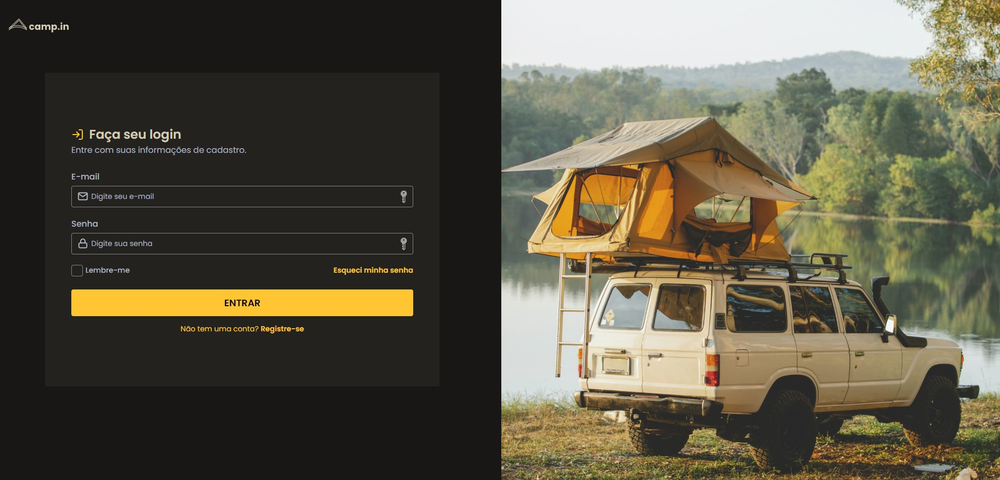
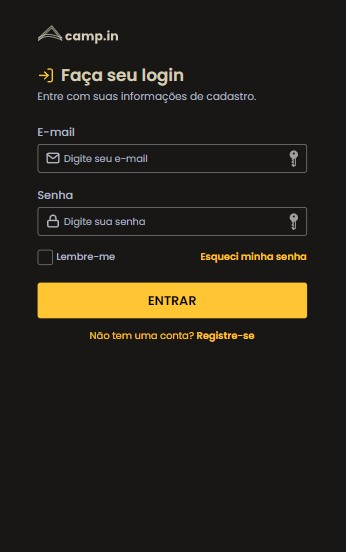

<h1 align="center">Responsive page with form</h1>

<strong>PT-BR</strong>: Página responsiva com formulário

DESKTOP & MOBILE VERSIONS:

    

 

## 🚀 Technologies 
<strong>EN:</strong> This project was developed with the following technologies:

-----
<strong>PT-BR:</strong> Esse projeto foi desenvolvido com as seguintes tecnologias:

- HTML e CSS
- Git e Github
- Figma

 

## 📖 Project
<strong>EN:</strong> Project made in Rocketseat's course "Explorer". 
 
The challenge is to create a form with personalized checkbox, different color for focus with mobile and desktop versions using media queries, css variables and flexible measurement units. The image on the side is suposed to appear only on the desktop version.
 
The layout was sent via Figma.

----
<strong>PT-BR:</strong> Projeto com formulário e responsividade, com checkbox personalizada e cor diferente para os campos de preenchimento quando estão em foco. Desenvolvido para versão mobile e destop usando media queries, variáveis de css e unidades de medida flexíveis. A imagem ao lado deve aparecer apenas na versão desktop.
 
O layout para consulta foi enviado através da plataforma Figma.
 
Projeto feito no curso Explorer da Rocketseat.
 
 
- Online project: https://lidiabrentano.github.io/responsive-page-and-form-01/
 

-----

By Lídia Brentano 💜
